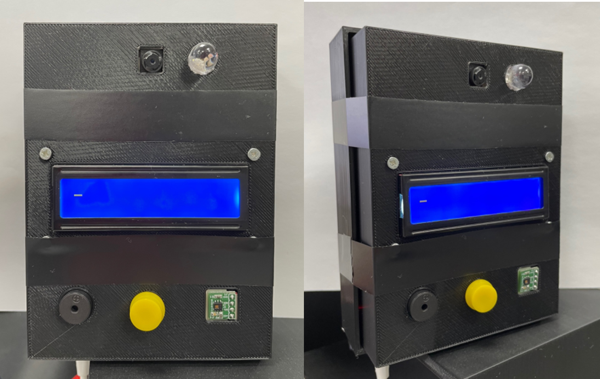

# Smart_Door_Lock
### **Smart Door Lock System with Raspberry Pi (얼굴 인식 스마트 도어락 시스템)**

그림1. 스마트 도어락 실물 완성본

#### <동작 영상>

#### 개발 배경: 기존 도어락의 문제점

1. 매번 긴 비밀번호를 누르고 들어가야함

   : 집 주인을 알아보고 문을 바로 열어주는 기능 필요

   

2.  도어락 마모 및 지문 흔적으로 인한 비밀번호 유출 가능성

   : 최근 비밀번호 유츌로 인한 범죄가 증가하고 있음

   

3. 집안일 등 다른 일을 하고 있거나 외출 중에 방문자를 확인하고 미리 문을 열어주기 어려움

   : 핸드폰으로 방문자를 쉽게 파악하고 어디서든 문을 원격으로 열어줄 수 있는 기능 필요

그림2. 스마트 도어락 예상 모식도

그림3. 회로도

#### 부품 리스트 

|                    제품  및 모델 명                    |                  비고                  |
| :----------------------------------------------------: | :------------------------------------: |
|                 라즈베리파이 3 Model B                 |         메인  서버 및 웹 연동          |
| 라즈베리파이 적외선 조광   NOIR  카메라 모듈  [YR-030] |       얼굴  인식 및 야간 측정용        |
|                 부저   [IMT12D2001AP]                  |       출입  허가 및 불가 효과음        |
|       4채널 TTL 3.3->5V 컨버터 모듈  [ELB060215]       |    라즈베리와 LCD 연결 시 전압 변환    |
|         HDC1080  I2C 고정밀  온습도  센서 모듈         |               체온  측정               |
|               RGB  LED 10파이(CA)  투명                |        도어락 열림 및 잠김 표시        |
|             브레드 보드용 4핀  택트스위치              |              초인종  버튼              |
|        아두이노 I2C 1602 LCD 모듈  [SZH-EK101]         | 출입  심사 상태 및 체온 측정 결과 표시 |

#### 전체 플로우 차트

